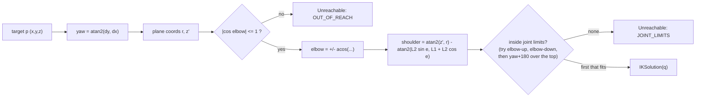

# robocell walkthrough

This guide is for explaining the project in an interview, assuming no robotics background.
Read top to bottom once, then use the Q&A at the end to rehearse.

## 1. Robotics basics used here

- **Joint:** a motor that rotates, like your shoulder. Our arm has three:
  - base yaw: the whole arm spins around a vertical axis, like a desk lamp turning on its base
  - shoulder: tilts the first link up and down
  - elbow: bends the second link relative to the first
- **Link:** a rigid bar between joints. We have two, the "upper arm" (length L1) and the
  "forearm" (length L2). The end of the forearm is the **tip** (where a gripper would be).
- **Joint angles (q):** the three numbers (yaw, shoulder, elbow) that fully describe the
  arm's pose.
- **Forward kinematics (FK):** given the joint angles, where is the tip? This is always easy:
  just trigonometry.
- **Inverse kinematics (IK):** given a point where the tip should go, which joint angles put
  it there? This is harder. There may be zero answers (too far away), two (elbow up or down),
  or infinitely many (a point directly above the base, where any yaw works).
- **Workspace:** every point the tip can reach. For our arm it is a thick spherical shell
  around the shoulder: at most L1+L2 away, at least |L1-L2| away, then trimmed by the joint
  limits.
- **Joint limits:** each joint has a minimum/maximum angle, a maximum speed and a maximum
  acceleration. Real motors and cables impose these.
- **Trajectory:** not just *where* to go but *how*, i.e. the joint angles as a function of time.
  Jumping instantly would need infinite acceleration, so we ramp up, cruise, and ramp down.

## 2. IK derivation step by step

Place the shoulder at height h above the base (bx, by). Target p = (x, y, z).

**Step 1: yaw.** The arm always works in one vertical plane. Turn the base to face the
target:

    yaw = atan2(y - by, x - bx)

Now forget 3D. In that plane the target has horizontal distance `r` from the base axis and
height `z' = z - h` above the shoulder:

    r = sqrt((x-bx)^2 + (y-by)^2)        z' = z - h

**Step 2: the elbow from a triangle.** Shoulder, elbow and target form a triangle with sides
L1, L2 and d, where d is the shoulder-to-target distance:

```
                elbow
                 /\
             L1 /  \ L2
               /    \
      shoulder o------* target
                  d          d^2 = r^2 + z'^2
```

The law of cosines gives the elbow bend:

    d^2 = L1^2 + L2^2 + 2 L1 L2 cos(elbow)
    cos(elbow) = (d^2 - L1^2 - L2^2) / (2 L1 L2)

If that value is above 1, the target is too far away. If it is below -1, the target is too
close. Either way, return `OUT_OF_REACH`. Otherwise elbow = +acos(...) or -acos(...): the two
mirror-image solutions.

**Step 3: the shoulder.** The shoulder angle is the direction to the target minus the angle
the bent forearm adds:

    shoulder = atan2(z', r) - atan2(L2 sin(elbow), L1 + L2 cos(elbow))



**Step 4: pick and check.**
- "Elbow-up" is the solution with the higher elbow. It is the preferred one, as on real arms,
  because it keeps the elbow away from the table.
- If elbow-up breaks a joint limit, try elbow-down, then "over the top": yaw + 180 degrees
  with the arm leaning back past vertical.
- Angles are periodic (350 degrees = -10 degrees), so every angle is shifted by multiples of
  360 degrees to fit inside its limits. For yaw, the value closest to the current yaw is
  chosen, so the base turns the short way round.
- Special case: a target exactly above the base (r = 0) makes atan2 meaningless. Any yaw
  works, so we keep the current one.

The code is in `src/robocell/kinematics.py`, in `inverse()` and `_planar()`. There are no
numeric solvers; it is all closed form.

## 3. How one task flows through the system

1. **Generated.** `src/robocell/cell.py`, `generate_tasks()`: a seeded random generator gives
   each task an arrival time (a Poisson process), a random target point and a priority.
2. **Arrives.** On its tick, the `control` actor (`Cell.control_step`) calls
   `Scheduler.submit()` in `src/robocell/scheduler.py`. It runs IK for every arm. If no arm
   can reach the point, the task is **rejected** right there.
3. **Queued.** Otherwise it goes into a list sorted by (priority descending, arrival order).
4. **Dispatched.** Every tick, `Scheduler.dispatch()` walks the queue. For each task it looks
   at idle arms that can reach it, asks each for an estimated move time (`Arm.estimate()`, the
   duration of the planned trajectory), and picks the fastest.
5. **Planned.** `Arm.assign()` in `src/robocell/arm.py` solves IK and builds a `Plan`:
   - one trapezoidal trajectory to the target (`src/robocell/trajectory.py`, `plan()`)
   - a second segment back home, if resting at the target would leave the arm inside a shared zone
   - for each segment, which zones the path may touch and until when (`zones.py`, `sweep()`)
6. **Waits for zones.** On its next tick the arm actor tries to lock all those zones in
   global order (`ZoneManager.acquire_in_order`). If one is busy, it waits in that zone's FIFO
   queue and counts zone wait time.
7. **Moves.** Once it holds every zone it needs, it advances along the trajectory each 10 ms
   tick (`Arm._advance`). It releases each zone as soon as the rest of its path can no longer
   touch it.
8. **Done.** When the first segment ends, the arm is exactly on target. It calls `on_done`,
   and `Cell._on_done` records the tip error and completion. The arm then retreats if
   needed, releases everything, and becomes idle.
9. **Monitored.** After all arms have moved, the `monitor` actor (`Cell._check`) verifies the
   safety invariants and records metrics (`src/robocell/metrics.py`).
10. **Reported.** When every task is completed or rejected and all arms are idle, the run
    ends, and `src/robocell/cli.py` prints the JSON summary.

If the arm **faults** mid-move, `Arm.inject_fault()` hands the task back
(`Scheduler.requeue`, at its original queue position) and another arm usually picks it up
next tick. If an **E-stop** is pressed, the arm freezes before its next tick and keeps its
task. After `reset()` it continues from where it stopped.

## 4. Scheduler and zone locking: why there is no deadlock

**Scheduler.** It serves highest priority first and first-come-first-served within a
priority. Each task goes to the idle capable arm that would finish the move soonest. A task
waits if all of its capable arms are busy, but it does not block lower-priority tasks that
other arms could do.

**The deadlock risk.** Arms A and B both need zones Z1 and Z2. A's path enters Z2 first, B's
enters Z1 first. If each locked zones as it reached them, A would hold Z2 waiting for Z1 while
B holds Z1 waiting for Z2. Both would wait forever.

**The rules that prevent it** (`src/robocell/zones.py`, module docstring):
1. Lock the **whole path** before moving. The arm computes every zone its entire planned
   motion might touch, before it moves at all.
2. Always lock in **one global order** (zones sorted by name), whatever order the path
   enters them.
3. A **moving arm never waits**, because it already holds everything it needs.
4. An **idle arm holds nothing**, because an arm never parks inside a zone. It retreats home
   instead.

With these rules, any arm that is waiting holds only zones that come *earlier* in the global
order than the one it waits for. A deadlock needs a cycle A → B → ... → A of "waits for a lock
held by". Along such a cycle the zone index would have to keep increasing and then come back
down, which is impossible. So no cycle, so no deadlock. Every lock holder is moving and
finishes in finite time. E-stops are the one exception, and releasing those is an operator
decision.

**Tests that prove it:**
- `tests/test_zones.py::test_crossing_paths_do_not_deadlock` builds exactly the A/B crossing
  case above (the paths enter the two zones in opposite orders).
- `tests/test_zones.py::test_many_arms_contending_no_deadlock_no_violation` runs 4, 6 and 8
  arms around a crowded center with heavy zone contention. It requires the run to finish (no
  deadlock) with zero violations, checked from outside the cell every tick.
- `tests/test_faults.py::test_random_faults_and_frequent_estops` adds random faults and E-stops.
- `scripts/verify.sh` asserts `finished: true` and zero violations for 3 seeds × 500 tasks.

**Not missing a zone.** We check a zone at discrete moments (every 2.5 ms) and at discrete
points on the arm (at most 5 cm apart). So we grow each zone by a margin we can prove is
enough: how far any point of the arm can move between two samples, plus half the point
spacing. Then nothing between samples can slip through. The monitor applies the same
conservative test at every tick. `tests/test_zones.py::test_sweep_never_misses_contact`
checks this against a 64× finer simulation.

**Determinism.** Every arm is an asyncio task, but they never race. `SimClock`
(`src/robocell/clock.py`) waits until every actor has finished the current tick, then wakes
them all in a fixed order. No code reads the wall clock, so the same seed gives
byte-identical output (checked by `verify.sh`).

## 5. Design trade-offs and simplifications vs real industrial arms

| This project | Real industrial arms |
|---|---|
| 3 joints (yaw, shoulder, elbow): position only | 6 or 7 joints: position *and* orientation of the tool; IK has up to 8+ solutions |
| Closed-form IK for a simple geometry | Closed form for common wrist designs, numeric solvers otherwise |
| Trapezoidal velocity (acceleration jumps instantly) | S-curve / jerk-limited profiles to reduce vibration |
| Straight lines in joint space | Often straight lines in Cartesian space (linear moves), with IK run continuously |
| Arm = line segments sampled at points | Full 3D meshes / capsules for collision checking |
| Shared zones as axis-aligned boxes, one arm at a time | Safety-rated zones, speed-and-separation monitoring, real-time collision avoidance |
| Arm-to-arm collision outside zones not modelled; the base column (pedestal) is not in the body model; the floor is not checked | Full cell collision model |
| E-stop = instant stop (category 0) | Category 0/1/2 stops with controlled braking |
| Faults are random and recover after a fixed time | Real diagnostics, operator acknowledgement |
| Scheduler is greedy and non-preemptive; an E-stopped arm keeps its task | Can be optimised globally (batching, look-ahead) |
| Zone locks are held for the whole remaining path | Finer-grained reservations (time slots, space-time planning) give more throughput |
| Fixed 10 ms tick, deterministic | Hard real-time controllers at 1-8 kHz |

The general rule was to choose the simplest model that still has the real problems:
multiple solutions, limits, shared space, concurrency, failures. Each of those problems is
then solved correctly and with tests.

## 6. Likely interview questions

1. **What does the project do in one sentence?** It simulates several robot arms sharing a
   workcell: it assigns reach tasks to arms, computes joint angles with closed-form IK, moves
   the arms along velocity-limited trajectories, and guarantees two arms are never in the
   same shared zone.

2. **FK vs IK?** FK maps joint angles to the tip position. It is unique and easy. IK maps the
   tip position to joint angles. It can have zero, two or infinitely many answers, and needs
   geometry (here the law of cosines) to solve.

3. **Walk me through your IK.** Yaw from atan2 flattens the problem into a plane. The law of
   cosines gives the elbow angle. Two atan2 terms give the shoulder. Then choose elbow-up,
   check joint limits, and fall back to elbow-down or the over-the-top pose.

4. **How do you know IK is right?** A property-based test (hypothesis) picks random joint
   angles, computes p = FK(q), and checks that IK(p) succeeds and FK(IK(p)) ≈ p to 1e-7. There
   are also tests for full extension, the inner boundary, the base axis, angle wrapping and
   every kind of limit violation. The reviewer ran 200,000 more round trips.

5. **What happens at the singularities?** At full extension cos(elbow) = 1: we clamp tiny
   floating-point overshoot and get elbow = 0. On the base axis, yaw is undefined, so we keep
   the current yaw (or the nearest legal one).

6. **Why a trapezoidal profile, and how are joints synchronised?** It is the simplest profile
   that respects both velocity and acceleration limits. All joints share one time-scaling
   curve s(t), which is sized so the most constrained joint just hits its limit. So all joints
   start and stop together and the path is a straight line in joint space.

7. **Why is the simulation deterministic even though it uses asyncio?** The clock is a
   barrier: it advances only when every actor is parked, then wakes them in a fixed order. No
   code reads wall time, and randomness comes from seeded generators.

8. **How does the scheduler choose an arm?** It takes the highest-priority, oldest task, then
   the idle arm that can reach it with the shortest planned move. Unreachable tasks are
   rejected on arrival. Tasks wait if their capable arms are busy.

9. **Why can't zone locking deadlock?** Each arm locks all the zones for its whole path before
   moving, always in the same global order. Moving arms never wait and idle arms hold nothing.
   So a waiting arm only holds lower-ordered locks, and a cycle is impossible.

10. **Couldn't an arm pass through a zone between two samples?** No. Zones are grown by a
    proven margin: the maximum distance any point of the arm travels between samples, plus
    half the spacing between body points. The test compares against a 64× finer simulation.

11. **What happens on an E-stop?** The arm halts before its next tick (a test checks the
    position does not change) and keeps its zone locks, because it may be physically inside
    a zone. After reset it re-plans from rest along the same line, so it never needs a new
    lock. A global E-stop does this for every arm.

12. **And on a fault?** Its task goes back into the queue at its original position and
    another arm usually takes it at once. If the faulted arm stopped inside a zone, it keeps
    only the locks it needs and, once repaired, moves only as far as the first pose clear of
    all zones.

13. **What metrics do you report?** Tasks completed/rejected/requeued, mean and p95 queue wait,
    per-arm utilisation, zone wait time per zone, faults, E-stops, safety-violation counters,
    and the maximum tip error (about 1e-16 m).

14. **How did you test concurrency and safety?** A monitor actor checks the invariants every
    tick in every run. The tests run long random simulations with 4-8 contending arms, random
    faults and E-stops, check the invariants from outside the cell every tick, and require
    identical output for identical seeds. The whole suite runs three times to catch flaky tests.

15. **What would you do next?** Model arm-to-arm collisions outside zones (capsule checks).
    Use jerk-limited profiles. Use finer space-time reservations instead of whole-path zone
    locks, which cost throughput. Add a 6-DOF arm with orientation. Make the scheduler
    preemptive, or give it look-ahead.

## Where to look

- Math: `src/robocell/kinematics.py`, `src/robocell/trajectory.py`
- Concurrency and determinism: `src/robocell/clock.py`, `src/robocell/cell.py`
- Safety: `src/robocell/zones.py`, `src/robocell/arm.py`
- Reviews and fixes: `docs/REVIEW.md`
- End-to-end checks: `scripts/verify.sh`
